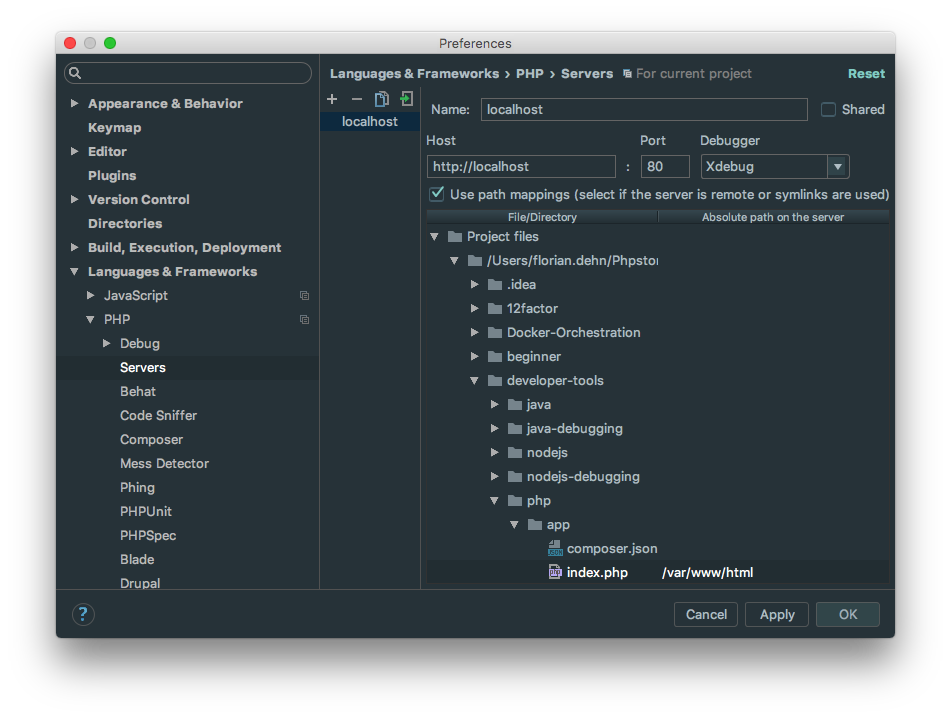
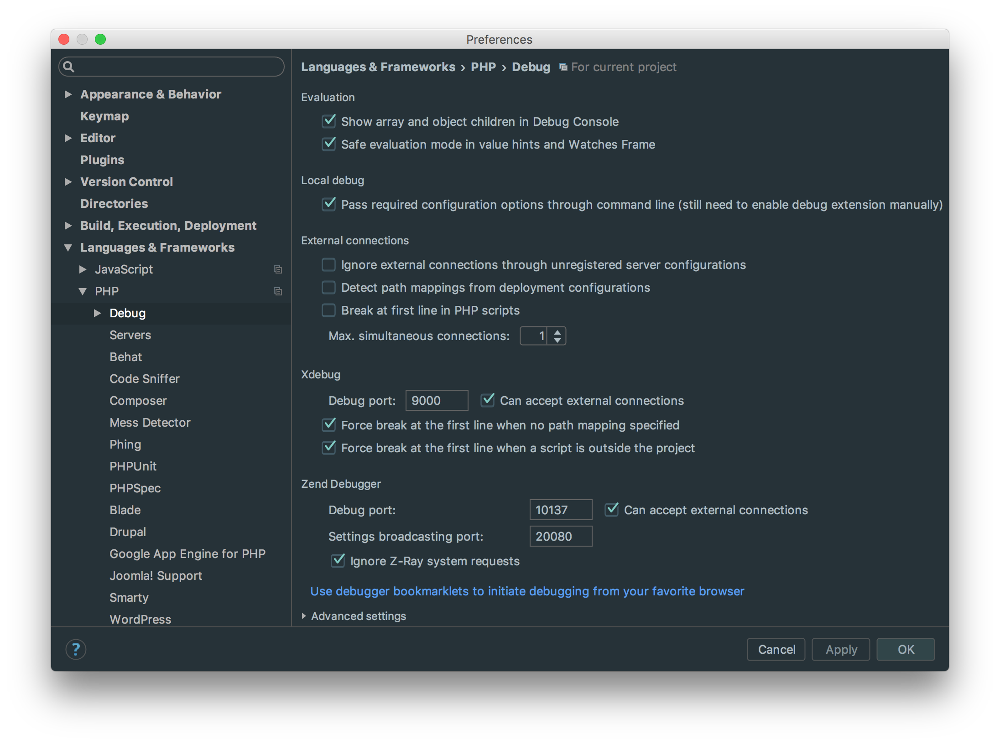
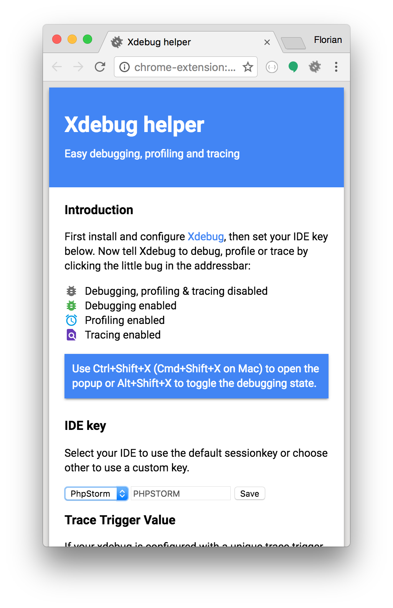
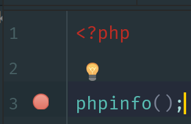
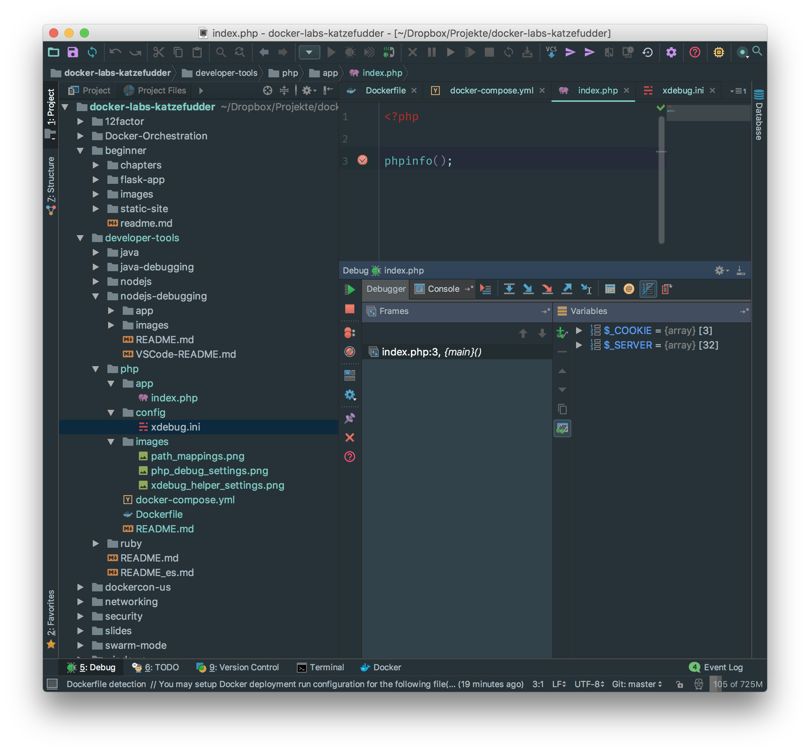

# Tutorial: Working and debugging PHP in Docker
The `docker-compose.yml` consists of two services: Webserver (Ubuntu 16.04, Apache2, PHP7) and Database (MySQL).
By mounting `app` into the Webserver container, you can easily work on the file(s) and see the effects by opening
[your browser](http://localhost).
You could easily start debugging your app using your preferred IDE (I assume you use PhpStorm).
Other IDEs offer similar abilities.

## Settings on your container

### Linux
Users should be good to go with nothing more than spinning up the container (`docker-compose up`).

### MacOS, with 'native' Docker
Your container `webserver` needs some information about your system (you local IP).
Open up `config/xdebug.ini` and comment out the standard configuration. Beneath, you find a configuration suitable
for MacOS. Just enter your local IP in `<your_local_ip>` and start your containers (`docker-compose up`).

## Settings PhpStorm

### Path mappings
You mounted your local project into the container. We now want to make PhpStorm aware what paths your code has been mounted to.
With that mapping in place, PhpStorm is able guide you through your code when debugging.
`app` -> `/var/www/html`

### PHP debug settings

We need to set PhpStorm to listen to Port 9000 on your local machine.
The remote part (the container) will try to connect back to your local machine on this port

### XDebug Helper Plugin for Chrome

Choose PhpStorm in the plugin's options. This sets a cookie with the according IDE key.
With this cookie in place, Xdebug on your remote machine will include this key in it's responses to your local host
so that PhpStorm recognizes this call.

### Debugging
Set a breakpoint in your code, then open [your browser](http://localhost).

Focus should change to PhpStorm and show something similar to the screen shot beneath.
